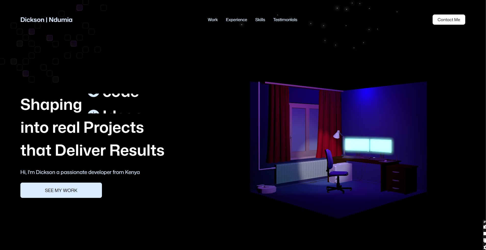

<!-- 
🚀 Intro 
-->
# 🚀 3D Portfolio – Built with Vite + React + Three.js

Welcome to my **3D Developer Portfolio**, where code meets creativity.  
This interactive site was crafted using **Vite**, **React**, and **Three.js**, blending performance and visuals to showcase my skills and projects in a cinematic 3D vibe.

---

<!-- 
📸 Live Demo 
-->
## 📸 Live Demo

🔗 [Visit the Site](https://threejs-nine-rosy.vercel.app/)

---

<!-- 
✨ Features 
-->
## ✨ Features

- 🎮 Real-time 3D visuals using **Three.js**
- 🎨 Smooth scroll + animations using **GSAP**
- ⚡ Ultra-fast builds with **Vite**
- 🖥️ Fully responsive (desktop + mobile)
- 📬 Functional contact form via **EmailJS**
- 🧠 Clean code & reusable React components

---

<!-- 
🧰 Tech Stack 
-->
## 🧰 Tech Stack

| Tech         | Description                          |
|--------------|--------------------------------------|
| **Vite**     | Fast dev server + build tool         |
| **React**    | Frontend library for UI              |
| **Three.js** | 3D rendering                         |
| **GSAP**     | Animations and transitions           |
| **EmailJS**  | Contact form integration             |
| **Tailwind** | Utility-first CSS framework          |

---

<!-- 
🎨 Credits / Inspiration 
-->
## 🎨 Credits / Inspiration

- Design & 3D flow inspired by [JavaScript Mastery](https://www.youtube.com/c/JavaScriptMastery)
- Special thanks for the 3D animation tutorial by [JavaScript Mastery](https://www.youtube.com/c/JavaScriptMastery)

---

<!-- 
🏁 Getting Started 
-->
## 🏁 Getting Started

Follow the steps below to run the project locally:

```bash
# 1. Clone the repo
git clone https://github.com/DICKSON39/threejs.git

# 2. Navigate into the project directory
cd threejs

# 3. Install dependencies
npm install

# 4. Run the dev server
npm run dev

# 5. Build for production
npm run build
```

<!-- ⚙️ Deployment -->

⚙️ Deployment
You can deploy this to:

Vercel (super easy)
 If you’re using Vercel, 
just push your repo and Vercel will auto-deploy it. Boom.





